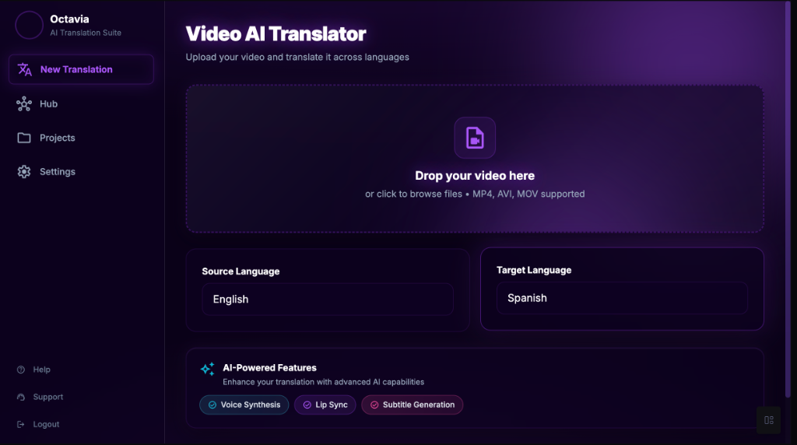

# Octavia

**Rise Beyond Language**

## 🌌 Overview

**Octavia** is a next-generation, cloud-native video translation platform designed to break down language barriers with cinematic quality. Built with a "Liquid Glass" aesthetic, it combines powerful AI models with a stunning, intuitive user interface.

Unlike traditional tools that simply overlay text, Octavia preserves the original experience. Our **Magic Mode** separates vocals from background music, translates the speech with context-aware LLMs, clones the original speaker's voice, and seamlessly remixes everything back together—all while keeping the original background audio intact.

## ✨ Key Features

### 🎬 Core Translation Features

*   **🔮 Video Translation (Magic Mode)**
    *   Translate full-length videos (up to 10 hours) with perfectly synced dubbed audio
    *   Isolates vocals from background music and SFX using advanced source separation (UVR5/Demucs)
    *   Clones the original speaker's voice in the target language (Coqui XTTS v2)
    *   Preserves background music and sound effects with intelligent ducking
    *   Multi-speaker diarization: Automatically detects and handles multiple speakers
    *   Lip-sync ready outputs with automatic timing adjustment

*   **🎙️ Audio Translation**
    *   Translate podcasts, lectures, and audio files between languages
    *   Voice cloning for consistent speaker identity across languages
    *   Support for long-form content with parallel processing

*   **📝 Subtitle Translation**
    *   Translate existing SRT/VTT subtitle files
    *   Context-aware translation using LLMs (GPT-4, Claude, Llama 3)
    *   Length-constrained translation to ensure subtitles fit within timing constraints
    *   Preserves formatting and special characters

*   **🗣️ Subtitle to Audio**
    *   Convert written subtitles into natural-sounding speech
    *   Multi-voice support for different speakers
    *   Customizable voice selection and audio parameters

*   **📹 Subtitle Generation**
    *   Auto-generate accurate subtitles from video or audio files
    *   Word-level timestamps for precise synchronization (WhisperX)
    *   Support for 50+ languages with automatic language detection
    *   Built-in subtitle editor for corrections and refinements

### 🎨 Design & User Experience

*   **🌊 Liquid Glass Design**
    *   Premium dark-mode interface with glassmorphism effects
    *   Deep purple gradients with dynamic glow animations
    *   Responsive, mobile-friendly layout
    *   Smooth transitions and micro-interactions

### 🧠 AI & Intelligence

*   **Context-Aware Translation**
    *   LLM-powered translation for natural, culturally relevant results
    *   Semantic chunking for better understanding of dialogue flow
    *   Iterative refinement to meet duration constraints
    *   Support for locally hosted LLMs (Ollama, LM Studio) for privacy

*   **Advanced Audio Processing**
    *   Voice Activity Detection (Silero VAD) for precise speech boundaries
    *   Speaker diarization (pyannote-audio)
    *   Background noise reduction
    *   Audio time-stretching without pitch distortion

### ⚡ Performance & Scalability

*   **Cloud-Native Architecture**
    *   Serverless GPU fleet (RunPod) scales from 0 to 200+ pods on demand
    *   Pay-per-second billing for cost efficiency
    *   Parallel processing for long videos
    *   Edge storage (BunnyCDN) for fast downloads worldwide

*   **Real-Time Progress Tracking**
    *   Live pipeline visualization showing current processing stage
    *   Sample chunk preview during translation
    *   Estimated time remaining
    *   Pause/resume support

### 🔐 Security & Account Management

*   **Authentication (Clerk)**
    *   Secure login with social providers (Google, GitHub, etc.)
    *   Multi-factor authentication (MFA)
    *   Team/organization support with role-based access
    *   Profile and security settings

*   **Billing & Plans**
    *   Flexible credit system
    *   Subscription tiers (Free, Pro, Enterprise)
    *   Usage analytics and invoice history

### 🎧 My Voices (Voice Library)

*   **Custom Voice Cloning**
    *   Create and manage custom voice clones from 6-second audio samples
    *   Library of personal and team voices
    *   Voice assignment for multi-speaker projects
    *   Voice quality preview and refinement

### 📊 Additional Tools

*   **Job History**
    *   View all past translation jobs
    *   Re-download previous exports
    *   Track credit usage per job

*   **Settings & Preferences**
    *   General app settings (theme, notifications)
    *   Advanced AI pipeline controls
    *   API key management for custom integrations

## 🛠️ Tech Stack

Octavia is built on a modern, scalable stack:

*   **Frontend:** Next.js 15 (App Router), Tailwind CSS, shadcn/ui, Framer Motion.
*   **Backend:** FastAPI (Python), Celery, Redis.
*   **AI & Compute:** RunPod (Serverless GPUs), PyTorch, FFmpeg.
*   **Models:** WhisperX (Transcription), Coqui XTTS v2 (Voice Cloning), UVR5 (Vocal Separation).
*   **Database:** Neon (Serverless Postgres).

## 📚 Documentation

Explore our detailed documentation to understand how Octavia works:

*   **[User Flow](documentation/connections/user_flow.md):** Visual guide to the application's navigation and page connections.
*   **[Production Architecture](documentation/production_architecture.md):** Deep dive into the cloud-native system design.
*   **[PyVideoTrans Explained](documentation/pyvideotrans_explained.md):** Detailed breakdown of the core video translation workflow.
*   **[Recommended Tools](documentation/recommended_tools.md):** The best open-source tools for building video AI pipelines.
*   **[Translation Strategies](documentation/translation_accuracy_strategies.md):** How we handle duration mismatches and ensure accuracy.

## 🚀 Getting Started

*(Coming Soon: Instructions for local setup and deployment)*

---

*Octavia is currently under active development. Join us in shaping the future of global communication.*

---

## 🌐 Connect with LunarTech

*   **Website:** [lunartech.ai](http://lunartech.ai/)
*   **LinkedIn:** [LunarTech AI](https://www.linkedin.com/company/lunartechai)
*   **Instagram:** [@lunartech.ai](https://www.instagram.com/lunartech.ai/)
*   **Substack:** [LunarTech on Substack](https://substack.com/@lunartech)

## 📧 Contact

*   **Tatev:** [tatev@lunartech.ai](mailto:tatev@lunartech.ai)
*   **Vahe:** [vahe@lunartech.ai](mailto:vahe@lunartech.ai)
*   **Open Source:** [opensource@lunartech.ai](mailto:opensource@lunartech.ai)

